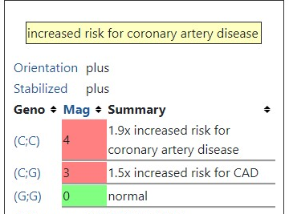

### Цели : 

Рассмотреть [базу по генотипированию](https://opensnp.org/data/11525.ftdna-illumina.9417?1669720006) пользователя [tundra9910](https://opensnp.org/users/11525) и выполнить следующие задания для нее:

##### Задание 1:
  1. Какой наиболее вероятный цвет глаз у этого человека?
с помощью системы IrisPlex 
  2. Определить степень риска тромбоза - на основе модели из 5 SNPs – rs6025 (F5, factor V Leiden), rs1799963 (F2, 20210 G > A), rs8176719 (ABO), rs2066865 (FGG, 10034 C > T), and rs2036914 (F11) (как на семинаре)
  3-5. Из snpedia выбрать три разных интересных снипа и проверить на предрасположенность/связи с тем или иным признаком (см например, список popular или любой другой) 
  
### Шаги:

Загрузим библиотеки

```r
knitr::opts_chunk$set(echo = TRUE)
```

```r
install.packages("readr")
install.packages("ggplot2")
install.packages("dplyr")
install.packages("gwascat")
install.packages("stringr")
install.packages("kableExtra")
install.packages("tidystringdist")
install.packages("tidyverse")
```

Скачаем [файл](https://opensnp.org/users/11525), удалим первые 12 строк и запишем в переменную genome_raw:


```r
genome_raw <- read.table("11525.ftdna-illumina.9417", header= TRUE , sep=',')
```


##### №1
Чтобы узнать цвет глаз, необходимо найти значения при **rs12913832, rs1800407, rs12896399, rs16891982, rs1393350, rs12203592** и внести их в таблицу IrisPlex, это можно сделать используя *grepl* и *filter*

```r
dplyr::filter(genome_raw, grepl('\\brs12913832\\b|\\brs1800407\\b|\\brs12896399\\b|\\brs16891982\\b|\\brs1393350\\b|\\brs12203592\\b', RSID))
```

```
A data.frame: 6 × 4
RSID	CHROMOSOME	POSITION	RESULT
<chr>	<chr>	<int>	<chr>
rs16891982	5	33951693	GG
rs12203592	6	396321	CC
rs1393350	11	89011046	GG
rs12896399	14	92773663	GG
rs1800407	15	28230318	CC
rs12913832	15	28365618	GG

```

Теперь мы можем подставить значения и узнать цвет глаз, внеся количество соответствующих аллелей в систему, мы получим:
<br/>

<br/>
То есть у рассматриваемого человека вероятнее всего **карие глаза**.
<br/><br/><br/>

##### №2
Далее узнаем вероятность тромбоза, рассмотрев **rs6025** (F5, factor V Leiden), **rs1799963** (F2, 20210 G > A), **rs8176719** (ABO), **rs2066865** (FGG, 10034 C > T), **rs2036914** (F11) 

```r
dplyr::filter(genome_raw, grepl('\\brs6025\\b|\\brs1799963\\b|\\brs8176719\\b|\\brs2066865\\b|\\brs2036914\\b', RSID))
```

```
A data.frame: 4 × 4
RSID	CHROMOSOME	POSITION	RESULT
<chr>	<chr>	<int>	<chr>
rs6025	1	169519049	CC
rs2066865	4	155525276	GG
rs2036914	4	187192481	CT
rs1799963	11	46761055	GG
```
Исходя из статьи [Multiple SNP testing improves risk prediction of first venous thrombosis](https://ashpublications.org/blood/article/120/3/656/30474/Multiple-SNP-testing-improves-risk-prediction-of) и из [SNPedia}(https://www.snpedia.com/) узнаём какой аллель повышают риск тромбоза:
1) rs6025 - AA
2) rs1799963 - AA
3) rs8176719 - GG
4) rs2066865 - TT
5) rs2036914 - СC

Смотрим на нашего клиента и складываем результаты - получилось **1**, повысил риск генотип rs2036914, так как гомозиготный
Если посмотреть в статье [Multiple SNP testing improves risk prediction of first venous thrombosis](https://ashpublications.org/blood/article/120/3/656/30474/Multiple-SNP-testing-improves-risk-prediction-of) на 3 график,
 то видим, что у клиента **понижен риск развития тромбоза**
<br/>

<br/>
<br/><br/><br/> 


##### №3
Рассмотрим 3 мутации:
1) rs1333049 - связан с риском ишемической болезни сердца CG
2) rs4988235 - связан с переносимостью лактозы AA
3) rs7903146 - связан с риском развития диабета 2ого типа СT


Рассмотрим, что у нашего клиента
```r
dplyr::filter(genome_raw, grepl('\\brs1333049\\b|\\brs1805007\\b|\\brs6152\\b', RSID))
```
```
A data.frame: 3 × 4
RSID	CHROMOSOME	POSITION	RESULT
<chr>	<chr>	<int>	<chr>
rs1333049	9	22125503	CG
rs4988235	2	136608646	AA
rs7903146	10	89011046	CT

```
**У клиента:**
rs1333049 - 1.5x риск развития ишемической болезни сердца 
<br/>

<br/>
rs4988235 - перевариает молоко, у нас AA, ориентация минус 
<br/>

<br/>
rs7903146 - 1,4-кратный повышенный риск диабета (и, возможно, рака толстой кишки) 
<br/>

<br/>

  
  
  
  
  
  
  
